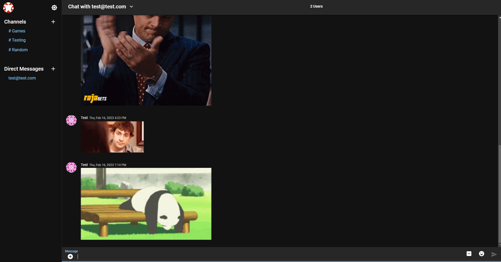
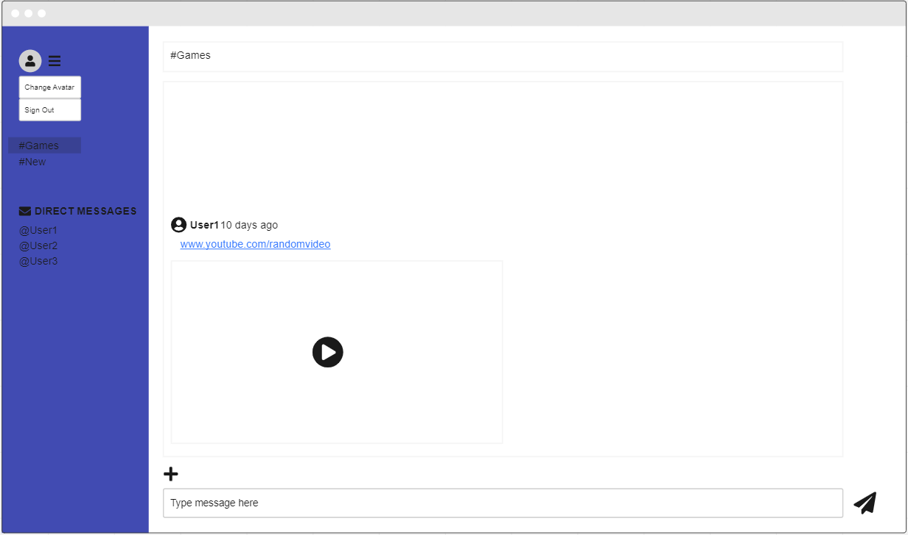
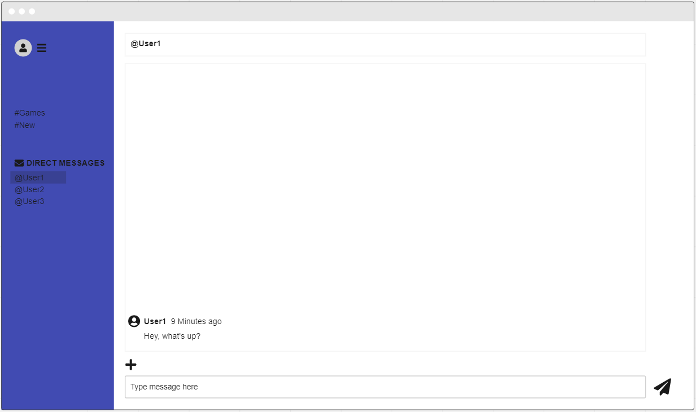
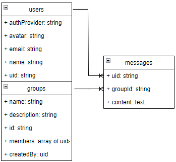

# EZ Chat

A chat app that includes channels for group discussions as well as direct messaging options for private conversations.

Live Site: https://chat.tylerbenbrook.com

## Tech Stack
- Nodejs
- React
- Firebase
- Moment
- react-router-dom
- react-toastify
- MUI for styling

## Installation Instructions
Clone the repository down then go into the folder that was just created and run 'npm i' which should install all the technologies required for the front end/client.
The backend uses multiple services from Firebase (Firestore, Authentication, & Firebase Storage) as well as Tenor integration for gifs so you'll need your own account/configuration settings which will connect automatically if you set your own values in a .env.local file. These fields are mapped in the application(make sure these are all prefixed with "REACT_APP_" in your .env):
API_KEY
AUTH_DOMAIN
DATABASE_URL
PROJECT_ID
STORAGE_BUCKET
MESSAGING_SENDER_ID
APP_ID
MEASUREMENT_ID
TENOR_API_KEY

## Wireframes
- Channel View

- Direct Message View

## ERD

## User flow
The user flow of the EZ Chat app would typically look something like this:

- User signs up or logs in to the app.

- User is presented with the main dashboard, showing a list of all channels.

- User can join existing channels or create a new channel by clicking on the "Create Channel" button.

- Once the user has joined a channel, they can view all the messages and files shared within that channel.

- User can communicate with other members by posting messages or sending direct messages.

- User can upload files by clicking on the "Upload File" button and selecting a file from their device.

- User can receive notifications for new messages, mentions, and direct messages.

- User can access their profile and settings by clicking on their profile picture.

- User can log out of the app by clicking on the "Logout" button in the settings section.

## User Stories
- As a user, I want to be able to join different channels and receive notifications for new messages and updates in real-time.
- As a user, I want to be able to send direct messages to other users for private conversations.
- As a user, I want to be able to easily switch between different channels to see updates and communicate with other users.

## Planned Schedule for Feature Work
Day 1:
Define and finalize the project scope and requirements.
Create the database and authentication systems using Firebase.

Day 2:
Design and build the login and sign-up screens.
Implement the dashboard view, showing a list of all channels and unread messages.

Day 3:
Implement the channel screen, allowing users to post messages and files, and view messages posted by others.
Implement direct messaging functionality.

Day 4:
Implement the file upload functionality.
Implement the search functionality for finding messages and files.

Day 5:
Implement the profile and settings screens, allowing users to update their profile information and change their password.
Test and debug the app to ensure all features are working correctly.
Prepare the app for deployment.

## MVP
- Secure user account creation/authentication and password reset.
- Users given random default avatar on account creation.
- Channels for users to send and view messages in.

## Stretch Goals
- Ability to upload files
- Avatar customization/custom picture upload
- Expanded profile details customization
- Direct chats between users or groups of users
- Inline video player for links

## Unsolved problems
I didn't have time to implement avatars, profile details or an inline video player however I'm still planning on adding them soon and don't anticipate any particular roadblocks for those.

The feature I'm currently working on is a way to display when a user has unread messages in any of the channels they're not currently in. I wasn't able to find a great way to track that in firestore based on any of the discussions I read from others but I'm planning on using a new lastSeen collection with a document per user that will hold an array of key value pairs where the key is the group/channel ID and the value is the timestamp for the most recently seen message in that channel.